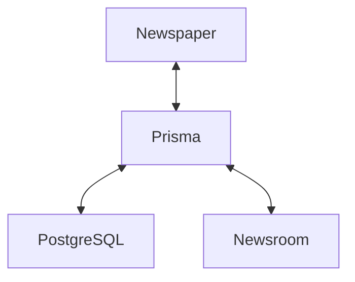

# TABLOID

A content management system for creating snackable stories on the web.

- Create beautiful and engaging content easily
- Sharable and linkable on the web

As if Web Stories and Remix had a baby 🕸👓💿🍼.

## QUICKSTART

    # Bring the whole stack up
    docker-compose up
    # Fill the bootstrap/inventory folder with MP4 videos
    # Then seed the database and static file storage with example data
    docker-compose --profile bootstrap up

## ABOUT

Tabloid let's you create immersive, short and snackable visual stories via an editorial content publishing platform. It's built on Google's Web Stories and Remix, a full stack web framework based on React.

Web Stories immerse your readers in fast-loading full-screen experiences. Easily create visual narratives, with tappable interactions. The Web Story format (formerly known as AMP Stories) is open source and can be shared and embedded across the web without being confined to a closed ecosystem or platform.

Web Stories provide content publishers with a mobile-focused format for delivering news and information as visually rich, tap-through stories.

## ARCHITECTURE

Tabloid consists of two Remix apps (called `Newsroom` and `Newspaper`) that talk via Prisma to the same PostgreSQL database.

### Newsroom

The `Newsroom` Remix app provides the content management system for creating and editing Web Stories (TBD as of yet).

### Newspaper

The `Newspaper` Remix app provides the Tabloid website that is internet facing and displays the individual Web Stories as well as the Tabloid Web Story player on the homepage.

## CONFIGURATION

Tabloid can be configured via the environment variables in `.env` which are passed into the Remix app via the docker-compose file.
The configuration file under `newspaper/app/config.server.ts` evaluates all env vars for `Newsroom` (with sane defaults) to the Remix server.

## DOCKER

Start the whole stack:

    docker-compose up

Seed the database and public assets with the contents of the `bootstrap/inventory` folder.

    docker-compose --profile bootstrap up

Enter a the PostgreSQL container:

    docker-compose exec postgres /usr/bin/psql -U postgres

Rebuild a container from scratch:

    docker-compose up -d --force-recreate --no-deps --build ${containername}

## PRISMA

TODO

## POSTGRES

TODO

### PSQL

Enter the PostgreSQL container:

    docker-compose exec postgres /usr/bin/psql -U postgres -d mydbname

Then you can use the database as follows:

    \l - Display database
    \c - Connect to database
    \dn\dn - List schemas
    \dt - List tables inside public schemas
    \dt schema1. - List tables inside particular schemas. For eg: 'schema1'.

Set database to custom schema:

    SET search_path TO storyprisma;

Get all items from ampMedia table (with stroyprisma schema):

    SELECT * FROM storyprisma."ampMedia";

## CAVEAT

There's a bug with Docker on M1 Macs which prevents PostgreSQL from being seen on the Docker network via hostname. Until this gets fixed https://github.com/prisma/prisma/issues/12598 work around this as follows:

    # Get the IP of the PostgreSQL docker contianer
    docker inspect -f '{{range.NetworkSettings.Networks}}{{.IPAddress}}{{end}}' tabloid-postgres-1
    # Replace the hostname of the Postgres container with the IP in the newspaper/.env file

# LICENSE

Tabloid is licensed under the terms of the Apache 2.0 License. See [LICENSE](LICENSE) for more information.
